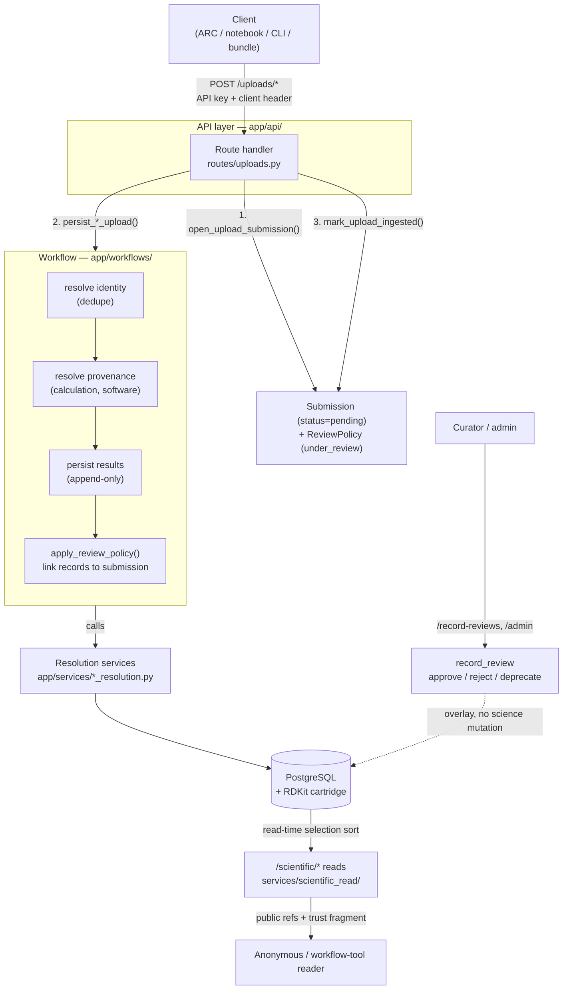

# System flow — how the backend fits together

This is the **connective map** of the TCKDB backend: what the moving
parts are, and — more importantly — how a piece of data *travels*
through them from upload to read. It is the "verbs" companion to
[`core_concepts.md`](core_concepts.md), which defines the "nouns"
(species vs species_entry, calculation, product, provenance). Read
that first if the terms below are unfamiliar.

Everything here is anchored to real code (`path:line`) so you can jump
straight to the seam. Design *rationale* lives in the decision records
under `docs/decisions/`; this doc is about
*mechanism*, not justification.

---

## 1. The one-paragraph mental model

TCKDB ingests computational-chemistry payloads and turns them into
queryable, provenance-tracked, human-reviewable scientific records.
Every write is wrapped in a **submission** (a reviewable unit). A
**workflow** orchestrates the write by calling **resolution services**
that *deduplicate identity* and *attach provenance*, then persist
*append-only results*. A parallel **curation** layer (reviews, trust,
machine review) tracks how much to believe each record without ever
mutating the science. Reads select the "best" product at query time
using review status and evidence — nothing is marked "preferred" in
the database.

Hold onto these four buckets — every table lives in exactly one, and
the whole design falls out of keeping them separate:

| Bucket | Question it answers | Deduped? | Example tables |
|---|---|---|---|
| **Identity** | *What is this thing?* | Yes — reused across uploads | `species`, `species_entry`, `chem_reaction`, `conformer_group` |
| **Provenance** | *How/when was this produced?* | No — every observation is new | `calculation`, `conformer_observation`, `software_release` |
| **Result** | *What number came out?* | No — append-only | `thermo`, `statmech`, `kinetics`, `transport` |
| **Curation** | *How much do we trust it?* | No — orthogonal overlay | `submission`, `record_review`, `record_machine_review` |

> This split is load-bearing. Identity tables dedupe so the same
> molecule isn't stored twice; result/provenance tables are append-only
> so re-running a calculation never overwrites history; curation is a
> separate overlay so review state never edits the science. See
> [`schema_analysis.md`](../schema_analysis.md) for the table-by-table
> categorization.

---

## 2. The lifecycle, end to end



### Step 0 — Entry (`app/api/router.py`, `app/api/app.py`)

One aggregate `api_router` is mounted at `/api/v1`. The middleware
stack is `RequestID → RateLimit → CORS` (`app/api/app.py`). Route
groups:

| Prefix | Auth | Purpose |
|---|---|---|
| `/scientific` | none (public) | The read surface — the phase-D public API |
| `/uploads` | API key + `X-TCKDB-Client-Name` version gate | Direct writes |
| `/bundles` | API key | Batch uploads (computed-species, computed-reaction) |
| `/submissions` | GETs public | Monitor submission status |
| `/record-reviews`, `/admin` | curator/admin | Curation |
| `/species`, `/reactions`, … | auth-gated (legacy) | Pre-phase-D entity reads |

Uploads are gated by `require_supported_tckdb_client` so an
out-of-date client can't silently write malformed payloads.

### Step 1 — Every write opens a submission (`app/services/upload_submission.py`)

The invariant: **no write happens outside a submission.** Each upload
route follows the same three-beat pattern:

```
open_upload_submission()  →  persist_*_upload()  →  mark_upload_ingested()
```

`open_upload_submission()` creates a `Submission` row at
`status=pending` and a `ReviewPolicy` at `status=under_review`. This is
*not* an approval judgment — `pending`/`under_review` is simply the
initial state of anything a curator can later see. Submission statuses:
`pending → approved | rejected`, plus `failed` (ingestion error).

A successful ingest calls `mark_upload_ingested()`, which appends an
`ingestion_succeeded` audit event but **leaves status at `pending`** —
successful ingestion is not approval. Failed sync uploads roll back
atomically (`get_write_db` commits on success / rolls back on error);
the failure is recorded in a *separate* transaction for audit via the
`@audit_sync_upload_failure` decorator.

### Step 2 — The workflow orchestrates the write (`app/workflows/`)

A workflow (e.g. `persist_conformer_upload` in
`app/workflows/conformer.py`) never touches the DB directly for
business logic — it calls **resolution services** in dependency order.
Using the conformer workflow as the canonical example:

1. **Resolve identity** — `resolve_species_entry`
   (`app/services/species_resolution.py`): canonicalize SMILES via
   RDKit, then look up or create `Species` keyed on
   `(canonical_smiles, charge, multiplicity)` — InChIKey is computed and
   stored alongside for cross-notation search but is **not** the dedup
   key (it cannot represent spin states and wrongly merges some
   tautomers; see DR-0031) — then look up or create `SpeciesEntry` on
   the `(species_id, kind, stereo_label, electronic_state, …)` tuple.
   Races are handled with a nested transaction + `IntegrityError`
   fallback.
2. **Resolve provenance** — `resolve_geometry_payload` (dedupe by XYZ
   hash) and `resolve_and_persist_calculation_with_results`
   (`calculation_resolution.py`) create the `Calculation` hub and its
   result rows, then attach input/output geometries.
3. **Match the conformer basin** — `conformer_resolution.py` computes a
   torsion fingerprint and either *reuses* an existing `ConformerGroup`
   (identity) or creates a new one — but **always** creates a new
   `ConformerObservation` (provenance). Cross-method consistency lives
   at the group level, never on an observation.
4. **Persist optional products** — statmech / transport resolution →
   append-only `Statmech` / `Transport` rows.
5. **Link to the submission** — `apply_review_policy()`
   (`app/services/record_review.py`) creates a `RecordReview` +
   `SubmissionRecordLink` for every record the workflow produced, so
   the whole contribution is reviewable as a unit.

> **Why this shape?** Upload schemas carry *scientific content*, never
> FK IDs. Identity resolution, dedup, and parent attachment happen here
> in services/workflows — never in the user-facing schema. See
> DR-0021.

### Step 3 — Async variant (`app/workers/upload_worker.py`)

Bundle and other heavy uploads enqueue an `UploadJob` (`status=queued`)
and open the submission *at accept time* (`open_job_submission`) so the
contribution is auditable from the moment it's accepted. A worker:

1. **Claims** a job with `SELECT … FOR UPDATE SKIP LOCKED` (safe for
   multiple workers), flips it to `processing`, increments `attempts`.
2. **Dispatches** by `job.kind` to the same `persist_*_upload` workflow
   used synchronously — the persistence path is identical.
3. **Records** `complete` + `mark_ingestion_succeeded`, or on repeated
   failure (`attempts >= max_attempts`) marks `failed` +
   `mark_ingestion_failed`.

Set `TCKDB_INLINE_WORKER=true` to run the worker in-process (tests /
single-node dev).

### Step 4 — Curation is a parallel overlay (`app/services/record_review.py`, `trust/`, `machine_review/`, `llm_precheck/`)

None of this mutates the science; it decides *how much to trust it*.

- **`record_review`** — human moderation state per record with a guarded
  transition machine (`not_reviewed ↔ under_review ↔ approved / rejected
  / deprecated`). A creator **cannot approve their own records**.
- **`trust/fragment.py`** — a *deterministic* trust fragment computed at
  read time from evidence (review status + completeness). No stored row
  needed.
- **`machine_review/orchestration.py`** — optional AI re-review. Appends
  an append-only `RecordMachineReview` verdict; **never** mutates
  `review_status`, `submission.status`, or public trust output.
- **`llm_precheck/service.py`** — optional submission-level advisory
  ("pass / needs_review / concerns"). Advisory only, disabled by default.

### Step 5 — Reads select the best product *at query time* (`app/services/scientific_read/`)

There is no "preferred" flag in the database. When a client reads, e.g.,
`/scientific/species-entries/{ref}/thermo`, the read service *sorts*
candidate records and returns the top one (`collapse=first`) or the full
list (`collapse=all`). The thermo sort key (`scientific_read/thermo.py`)
is, in order: covers the requested temperature range → smaller
extrapolation distance → higher review status → higher evidence
completeness → newer → higher id. `ConformerSelection` rows exist for
curator-pinned display defaults but are currently *advisory*; the
read-time sort is primary.

Responses address records by **public ref** (`species_…`, `geom_…`,
`lot_…`), never integer PKs, and default to filtering by
`min_review_status` so anonymous readers see curated data unless they
explicitly opt into drafts.

---

## 3. Where each subsystem lives (and its "start here" doc)

| Subsystem | Code | Start-here doc |
|---|---|---|
| Identity (species/reactions/TS) | `db/models/species*.py`, `services/species_resolution.py`, `reaction_resolution.py` | [`species_design.md`](../species_design.md) |
| Conformers | `services/conformer_resolution.py`, `workflows/conformer.py` | DR-0005 |
| Calculations | `services/calculation_resolution.py`, `db/models/calculation*.py` | [`scientific_calculation_reads.md`](../../backend/docs/specs/scientific_calculation_reads.md) |
| Scientific products | `services/{statmech,thermo,kinetics,transport}_resolution.py` | [`scientific_product_candidacy.md`](../../backend/docs/specs/scientific_product_candidacy.md) |
| Pressure-dependent networks | `workflows/network*.py`, `services/network_resolution.py` | DR-0001 |
| Provenance (software/LOT) | `services/software_resolution.py`, `db/models/level_of_theory.py` | DR-0008 |
| Literature | `services/literature_resolution.py`, `literature_metadata.py` | [`literature_policy.md`](../literature_policy.md) |
| Submissions & ingestion | `services/upload_submission.py`, `workflows/` | [`ingestion_submission_model.md`](../../backend/docs/specs/ingestion_submission_model.md) |
| Trust & review | `services/{record_review,trust,machine_review,llm_precheck}/` | [`automated_trust_layer.md`](../../backend/docs/specs/automated_trust_layer.md) |
| Uploads & idempotency | `api/routes/uploads.py`, `services/upload_reconciliation.py` | DR-0024 |
| Bundles / offline | `api/routes/bundles*.py` | [`contribution-bundles/v0-format.md`](../contribution-bundles/v0-format.md) |
| Read/query API | `services/scientific_read/`, `api/routes/` | `read_api_mvp.md` |
| Async jobs | `workers/upload_worker.py`, `db/models/upload_job.py` | [`upload_worker_tests_spec.md`](../upload_worker_tests_spec.md) |
| Auth & roles | `api/` dependencies | [`auth-and-roles-v1-spec.md`](../auth-and-roles-v1-spec.md) |

For a *task → doc* router covering the full ~160-file doc set, see the
"Where to look" table in [`CLAUDE.md`](../../CLAUDE.md).

---

## 4. Rules of thumb the design enforces

- **Never put FK IDs in an upload schema.** Embed scientific content;
  let services resolve identity. (Read schemas may expose public refs.)
- **Identity dedupes; results/provenance are append-only.** Never add a
  "preferred" or "selected" column to a result table — selection is a
  read-time sort or an explicit curation row.
- **Curation never edits science.** Reviews, trust, and machine review
  are overlays; they change *belief*, not values.
- **Every write is a submission.** If you add a write path, it opens a
  submission and links its records via `apply_review_policy()`.
- **Enums live in `db/models/common.py`; never inline.** New model
  modules must be imported in `db/models/__init__.py` or Alembic won't
  see them.
