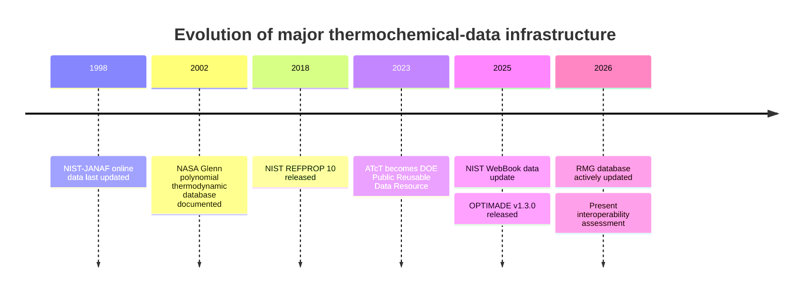
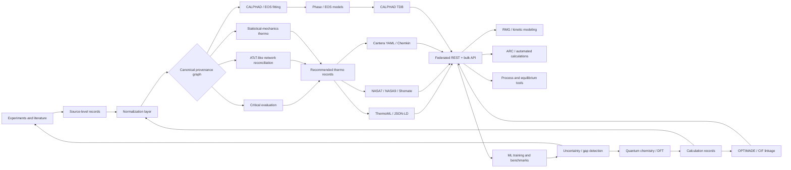
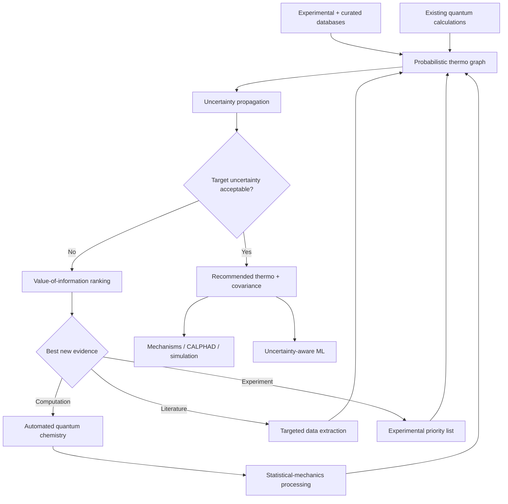

# Current Thermochemical Databases and the Interoperability Landscape

## Executive summary

The thermochemical-data ecosystem in 2026 is **rich but structurally fragmented**. There is no single database that simultaneously provides broad chemical coverage, experimentally grounded values, quantified uncertainty, full temperature/pressure dependence, rigorous provenance, machine-readable access, permissive licensing, and seamless interoperability across molecular chemistry, combustion, process engineering, geochemistry, and condensed-matter thermodynamics. Instead, the highest-quality information is distributed among resources optimized for fundamentally different purposes: critically evaluated molecular thermochemistry in NIST and ATcT; experimental thermophysical data in NIST TRC/ThermoML, DIPPR, and Dortmund Data Bank; high-temperature polynomial thermochemistry in NASA/Burcat; fluid equations of state in REFPROP; CALPHAD databases in Thermo-Calc and FactSage; geochemical reference datasets in the OECD/NEA TDB ecosystem; and mostly 0 K first-principles formation energies in Materials Project, OQMD, and AFLOW. citeturn1view0turn1view2turn2search1turn24view0turn22view3

The strongest resources also solve **different epistemic problems**. ATcT performs network-based reconciliation of mutually connected thermochemical measurements and calculations, exposing correlations and influential determinations; NIST TRC critically evaluates experimental thermophysical data and explicitly represents uncertainty; DIPPR uses expert evaluation and predictive estimates when experiments are missing; CALPHAD databases optimize internally consistent Gibbs-energy models over composition and temperature; while Materials Project computes internally standardized DFT energies and 0 K phase stability rather than experimental standard-state thermochemistry. These should not be combined as if they were interchangeable observations. citeturn1view2turn2search1turn4search2turn11view0turn19view1

The most important technical conclusion is therefore that a next-generation thermochemical infrastructure should **not be another static master table**. It should be a **versioned federation and reconciliation layer** that preserves each source's semantics and license while normalizing chemical identity, phase, standard state, temperature, pressure, uncertainty, provenance, computational method, and derivation relationships. ThermoML is the closest mature standard for experimental thermodynamic-property exchange, while OPTIMADE solves a related interoperability problem for materials structures. Neither currently provides the complete cross-domain schema needed to connect molecular thermochemistry, NASA polynomials, CALPHAD models, geochemical species, and quantum-chemistry calculations. citeturn2search0turn2search1turn22view1

A particularly important opportunity exists at the **experimental–computational boundary**. Materials Project explicitly notes that its principal compositional phase diagrams are constructed from DFT energies at \(T=0\) K and \(P=0\) atm, whereas conventional chemical thermochemistry requires finite-temperature enthalpies, entropies, heat capacities, phase transitions, and defined standard states. citeturn19view1 A system that automatically connects high-quality electronic-structure calculations, vibrational/rotational/statistical-mechanical corrections, literature measurements, ATcT-style consistency constraints, and uncertainty propagation would fill a gap not adequately addressed by today's major resources.

**My priority ranking for a new infrastructure is:**

1. **Canonical, versioned thermo provenance graph**—one record per observation, calculation, fitted model, and derived result; never flatten conflicting values prematurely.
2. **Explicit thermodynamic state semantics**—phase, polymorph, charge, spin, standard state, reference state, \(T\), \(P\), composition, activity convention, and phase transition information must be mandatory.
3. **Uncertainty and covariance as first-class objects**, adopting the philosophy demonstrated by ATcT and critically evaluated TRC resources. citeturn1view2turn2search1
4. **Machine-readable adapters rather than scraping pipelines**—ThermoML/XML for experimental data, JSON/JSON-LD and columnar bulk distributions for new APIs, Cantera YAML/NASA polynomials for kinetics workflows, CALPHAD TDB adapters for phase modeling, and OPTIMADE/CIF for crystalline materials. citeturn25view1turn22view1
5. **Entitlement-aware commercial connectors** for DIPPR, Reaxys, DDB, Thermo-Calc, and FactSage rather than illegally redistributing proprietary data.
6. **Automated thermodynamic consistency tests**—Hess cycles, \(C_p\) integration, phase-transition closure, elemental reference-state checks, atom/charge balance, and cross-source outlier detection.
7. **A reproducible computational layer** that records geometry, conformer, electronic method, basis/pseudopotential, frequencies, hindered-rotor treatment, symmetry, spin treatment, corrections, and software versions.
8. **A benchmark/active-learning layer** that identifies species or reactions whose uncertainty most strongly limits mechanisms, equilibrium calculations, or ML models.

The broader strategic point is that **data quality rather than raw volume is the principal bottleneck**. PubChem and Reaxys contain vastly broader chemical information than ATcT, but breadth does not make their thermochemical fields an equivalent reference standard. Conversely, ATcT's network methodology is exceptionally strong for the quantities and species it covers but is not a general-purpose finite-\(T\) thermophysical database. citeturn23search34turn4search3turn4search7turn1view2

## Landscape and taxonomy

"Thermochemical database" currently covers at least six substantially different classes of resource. Treating them as one class is a major source of integration errors.

| Resource class | Canonical examples | What is fundamentally stored | Principal strength | Principal limitation |
|---|---|---|---|---|
| **Reference molecular thermochemistry** | ATcT, NIST-JANAF, NIST WebBook | \(\Delta_fH^\circ\), \(S^\circ\), \(C_p^\circ(T)\), \(G^\circ\), phase-change quantities, ion energetics | Experimentally anchored, chemically interpretable | Coverage uneven; state conventions vary |
| **Experimental thermophysical archives** | NIST TRC/ThermoML, DIPPR, DDB | Individual measurements, correlations, uncertainties, mixture properties, equilibria | Rich \(T/P/x\) information and provenance | Heterogeneous experiments; several major datasets commercial |
| **High-temperature polynomial libraries** | NASA Glenn/CEA, Burcat | Fitted \(C_p,H,S\) polynomial coefficients | Very efficient for combustion/equilibrium codes | Fitted representation may obscure source measurements and covariance |
| **Equation-of-state resources** | REFPROP | Parameterized EOS/transport models | High-accuracy fluids and mixtures over \(T/P\) domains | Limited chemical universe relative to general molecular databases |
| **Solution/phase-model databases** | Thermo-Calc, FactSage, SGTE ecosystem | Gibbs-energy models for phases and solution parameters | Multicomponent equilibrium and finite-\(T\) phase diagrams | Model/database licensing and format fragmentation |
| **Computational repositories** | Materials Project, AFLOW, OQMD, NOMAD, JARVIS, OpenKIM | DFT energies, structures, calculations, models | Huge materials search space, reproducible computation | Usually not experimental finite-\(T\) thermochemistry |

The distinction between **datum** and **model** is especially important. NASA coefficients, REFPROP equations of state, and CALPHAD Gibbs-energy descriptions are models fitted or constructed from underlying information; a single coefficient set is not equivalent to a calorimetric observation. Cantera, for example, makes this explicit: species models parameterize standard-state \(C_p^\circ(T)\), \(h^\circ(T)\), and \(s^\circ(T)\); it separately supports NASA-7, NASA-9, and NIST-style Shomate representations. citeturn25view1

There is also a major distinction between **experimental thermochemistry and computed formation energy**. Materials Project calculates formation energies and convex-hull stability from electronic-structure energies; its standard compositional phase diagrams are principally \(T=0\) K, \(P=0\) atm constructions. Its own documentation cautions that DFT errors and finite-temperature effects produce expected deviations from experimental phase diagrams. citeturn19view1 This means a value labeled `formation_energy` in a materials API should never automatically be merged with a 298.15 K experimental \(\Delta_fH^\circ\).

### Historical and operational context

The current infrastructure spans multiple generations. NIST-JANAF's online SRD 13 records a last data update in 1998; NASA's widely used Glenn polynomial database was documented in 2002; REFPROP 10 was released in 2018; ATcT became a U.S. DOE Office of Science Public Reusable Data Resource in 2023; the Chemistry WebBook reports a 2025 data update; OPTIMADE released specification v1.3.0 in December 2025; and RMG's public site reports database updates in August 2026. citeturn1view1turn17search5turn24view0turn1view2turn1view0turn22view1turn25search0



A key implication of this timeline is that **hosting longevity is not equivalent to data currency**. JANAF remains a highly useful, officially hosted reference, but its online dataset is historically frozen. NASA polynomial data remain deeply embedded in combustion software even where newer source values exist. Conversely, continuously updated aggregators may contain recent measurements without having subjected them to the same level of critical reconciliation. citeturn1view1turn17search5turn1view2

## Major thermochemical databases and repositories

### Reference molecular and engineering databases

| Resource | Scope, phases and \(T/P\) domain | Data and representation | Provenance / quality control | Access, status and updates | API, bulk access and interoperability | Typical uses |
|---|---|---|---|---|---|---|
| **NIST Chemistry WebBook, SRD 69** citeturn1view0 | Broad molecular chemistry: neutral thermochemistry, condensed-phase data, ion energetics, organometallic data, phase-change quantities and selected fluid properties. \(T/P\) ranges are property- and species-specific. | \(\Delta_fH^\circ\), \(S^\circ\), \(C_p\), phase-change enthalpies, ionization/electron data, Henry constants, thermophysical properties, spectra; Shomate fits are common for \(C_p/H/S\). Cantera explicitly supports WebBook-style Shomate coefficients. citeturn25view1 | NIST compilation from identified literature/source databases; property records normally retain references. | **Hosted/current.** Free web access under NIST SRD terms; site reports data last updated in 2025 and page/site changes in March 2025. citeturn1view0 | Search/query web interface and downloadable individual representations; no modern, formally documented general REST API identified in this audit. No native ThermoML interface. | Gas-phase thermochemistry, mechanism development, reference checks, spectroscopy, property estimation validation. |
| **NIST-JANAF Thermochemical Tables, SRD 13** citeturn1view1 | Elements and inorganic/selected molecular species, gas and condensed phases; historically designed for wide-temperature equilibrium/high-\(T\) work. | Tabulated \(C_p^\circ\), \(S^\circ\), \(H^\circ(T)-H^\circ(0)\), \(\Delta_fH^\circ\), \(\Delta_fG^\circ\), equilibrium functions. | Critically evaluated JANAF reference tables. | **Hosted but legacy/frozen.** NIST reports last data update **1998**; fourth-edition material remains online. citeturn1view1 | Web search/table display and edition downloads; no modern REST API; not ThermoML-native. | Combustion, high-temperature equilibrium, validation of polynomial fits, historical reference values. |
| **Active Thermochemical Tables, ATcT** citeturn1view2 | Primarily molecular/species thermochemistry, including stable, reactive and transient species. Particularly strong for interconnected gas-phase thermochemistry. Not intended as a universal \(C_p(T,P)\) archive. | Network-derived \(\Delta_fH\), Gibbs quantities, reaction enthalpies, bond dissociation energies, acidity/proton affinity; reaction queries include 0 K and 298.15 K. | Distinctive **thermochemical-network optimization** combining experimental and theoretical constraints; includes correlations and analysis of influential determinations. | **Hosted/current.** DOE Office of Science Public Reusable Data Resource since March 2023. The site identifies release TN 1.222 and provenance analysis for more than 3,400 species. citeturn1view2 | Interactive web queries/releases. A stable public bulk REST API was not identified in the reviewed official material. No native ThermoML endpoint. | Benchmark formation enthalpies, high-accuracy kinetics/thermochemistry, reaction cycles, validation of quantum chemistry. |
| **NIST ThermoML Archive** citeturn2search0turn2search7 | Experimental thermophysical and thermochemical data for pure compounds, mixtures and reactions; conditions are carried at the measurement level rather than imposing one universal \(T/P\) range. | **ThermoML**, an IUPAC XML standard capable of representing experimental, predicted and critically evaluated property data. citeturn2search0turn2search3 | NIST TRC/Journals workflow; Guided Data Capture and related processes preserve literature provenance and structured metadata. citeturn2search1 | **Hosted/current archive.** Publicly accessible journal-associated ThermoML records; licensing should be checked per archive/source rather than assumed universally permissive. | XML downloads are its major interoperability advantage. This is the strongest existing standardized interchange mechanism among experimental thermodynamics resources. | Data mining, property-model development, ML datasets, automated literature-data exchange. |
| **NIST TRC / ThermoData Engine / Web Thermo Tables / ILThermo family** citeturn2search1 | Pure compounds, binary/ternary mixtures, chemical reactions and specialized collections including ionic liquids. | Experimental measurements, correlations, critically evaluated recommended values, uncertainties and generated tables. | TRC explicitly compiles and critically evaluates available experimental data with thermodynamic-consistency tests and expert oversight. citeturn2search1 | **Hosted/current family.** Access model varies: some tools/data are free, while WTT and other products may require subscription/licensing. | ThermoML is a native component of the TRC ecosystem; TDE provides dynamic evaluation rather than merely static tables. | Process design, reference-quality property evaluation, mixture modeling, research data capture. |
| **NASA Glenn thermodynamic database / CEA / ThermoBuild** citeturn17search5 | More than 2,000 solid, liquid and gaseous species in the documented NASA Glenn library, with species data extending over approximately **200–20,000 K**, though individual validity ranges vary. citeturn17search5 | NASA polynomial representations for \(C_p^\circ,H^\circ,S^\circ\); modern NASA equilibrium software uses nine-coefficient forms. Cantera supports NASA7 and NASA9 and identifies ThermoBuild as a NASA9 source. citeturn25view1 | Compiled/evaluated source thermochemistry converted into internally consistent polynomial fits for CEA-family calculations. | **Hosted/legacy but operationally important.** Core published database is 2002-era; current update cadence for the underlying master library is not clearly specified in the reviewed official material. | Traditional NASA text/poly coefficient formats; CEA/ThermoBuild; easy conversion into Cantera and many combustion codes. No ThermoML-native representation. | Rocket/combustion equilibrium, high-temperature gases, plasma/aerospace chemistry, mechanism input. |
| **Burcat/Ruscic Third Millennium thermochemical database** citeturn4search0turn4search4 | Ideal-gas and some condensed-phase thermochemistry aimed primarily at combustion and atmospheric/air-pollution chemistry; radicals and reactive intermediates are important strengths. | NASA-style polynomial thermochemistry plus source/comment information. | Literature compilation and evaluation by Alexander Burcat and collaborators; later closely associated with Ruscic/ATcT work. | **Hosted/mirrored; versioned irregularly.** Multiple institutional/mirror locations exist; a uniform current update frequency is not specified. citeturn4search19 | Flat-file polynomial distributions are easy to consume in combustion software. No native ThermoML API. | Combustion mechanisms, Chemkin/Cantera inputs, radical thermochemistry, cross-checks against NASA/ATcT. |
| **DIPPR Project 801** citeturn4search2turn4search13 | Industrially important pure compounds with extensive physical and thermodynamic properties over property-specific valid temperature ranges. | Dozens of constants and temperature-dependent correlations; examples include \(C_p\), enthalpy-related quantities, vapor pressure, density and transport properties. | AIChE describes Project 801 as **critically evaluated**; recommended values include metadata/uncertainties, and predictive methods are used where measurements are missing. citeturn4search2turn4search6 | **Hosted/current, commercial.** Paid/licensed. Project QC supports continuing data-quality work; exact public release cadence is unspecified. | Licensed database/software integrations; no open ThermoML bulk endpoint identified. | Chemical/process design, simulation, safety, property correlation, industrial reference calculations. |
| **Dortmund Data Bank, DDB** citeturn24view1 | Very strong experimental pure-component and **mixture** coverage: VLE, solubility, transport, caloric properties, polymers, adsorption, gas hydrates, mixture densities and specialty areas. \(T/P/x\) conditions are record-specific. | Experimental tables plus correlations/model parameters; phase equilibria, caloric and transport properties. | Literature-derived, commercially curated database combined with regression/prediction tooling. | **Hosted/current, commercial.** The official site lists active 2025/2026 documentation and update channels. citeturn24view1 | DDB software and online services; access/bulk interfaces license-dependent. No native public ThermoML service identified. | VLE/LLE/SLE regression, UNIFAC development, process simulation, mixture-property modeling. |
| **NIST REFPROP, SRD 23** citeturn24view0 | Version 10 includes **147 pure fluids, five pseudo-pure fluids and mixtures of up to 20 components**, including refrigerants, hydrocarbons, cryogens, natural-gas constituents and industrial fluids. EOS-specific \(T/P\) limits apply. citeturn24view0 | EOS-derived \(P,T,\rho,U,H,S,C_p,C_v,G\), fugacity, chemical potential, phase equilibrium, heat of vaporization, sound speed, transport, surface tension and many derived properties. | High-accuracy Helmholtz/MBWR/other EOS with literature-derived equations and experimentally fitted mixture parameters; fluid files include references/DOIs. citeturn24view0 | **Hosted/current product; commercial.** REFPROP 10 remains the official version; NIST page updated August 2024. | Fortran source/routines, shared library/DLL, Excel and examples in Python/C++/MATLAB/VB; designed for programmatic embedding. citeturn24view0 Not ThermoML-native. | Refrigeration, cryogenics, energy systems, accurate fluid/process calculations. |
| **Reaxys** citeturn4search3turn4search7 | Enormous chemistry literature/patent aggregation covering compounds, reactions and experimental properties rather than a dedicated reference thermochemistry collection. Elsevier reported roughly **500 million experimental property values** across hundreds of property fields in 2026. citeturn4search7 | Heterogeneous reported physical/chemical properties, synthesis and reaction records; thermochemical values appear where extracted from sources. | Curated/extracted from journals, patents and other chemistry sources; not an ATcT-style globally reconciled thermo network. | **Hosted/current, paid subscription.** | Licensed export/API capabilities depend on subscription; no native ThermoML service identified. | Literature discovery, locating obscure measurements, compound/reaction context, provenance discovery. |
| **PubChem** citeturn23search34 | Extremely broad chemical-entity coverage with contributor-supplied physical/chemical properties; not specifically a thermochemical reference database. | Heterogeneous property records attached to compounds plus chemical identity, bioactivity and literature links. | Aggregation from many contributors/databases; thermochemical fields inherit source-specific curation and conditions. | **Hosted/current and freely accessible.** PubChem describes itself as the world's largest freely accessible chemical-information collection. citeturn23search34 | Strong programmatic ecosystem and downloadable records; thermochemical semantics are less normalized than ThermoML. | Entity resolution, broad property discovery, linking identifiers/sources; useful as discovery metadata rather than an unquestioned thermochemical ground truth. |

### How the major reference resources complement rather than replace each other

For **high-accuracy \(\Delta_fH^\circ\)** of gas-phase molecules or radicals, ATcT is often the best starting point because its network treatment can make use of constraints distributed across many reactions and species. citeturn1view2 For **temperature-dependent \(C_p,H,S\)** values needed by a combustion solver, JANAF, NASA/Burcat, WebBook Shomate fits, or an RMG/Cantera representation may be more directly usable. citeturn1view0turn17search5turn25view1

For **raw experimental measurements and mixtures**, ThermoML/TRC and DDB address a different problem: they preserve property measurements at actual experimental conditions instead of reducing everything to a single standard-state value. citeturn2search1turn24view1 DIPPR sits between literature data and engineering use by delivering critically evaluated correlations and recommended property values. citeturn4search2

For **fluids at elevated pressure**, REFPROP is far more appropriate than JANAF or a NASA ideal-gas polynomial, because it explicitly employs equations of state and mixture models to describe density, fugacity, phase equilibria, transport properties and related quantities. citeturn24view0

That division of labor should be retained in any unified system. A federation should answer not merely "what is the enthalpy?" but rather **"which definition of enthalpy, of which chemical state, at what \(T/P\), from which experiment or model, with which uncertainty and transformation history?"**

## Materials, phase-equilibrium and domain-specific resources

### Condensed-matter and phase-model databases

| Resource | Scope / thermodynamic domain | Data model and curation | Access, hosting and update status | Programmatic interoperability | Best use—and caution |
|---|---|---|---|---|---|
| **Thermo-Calc databases** citeturn11view0turn11view1 | More than 40 database/product families covering steels, Ni, Al, Mg, Cu, Ti, high-entropy alloys, oxides, molten salts, nuclear and other materials; finite-\(T\), composition-dependent condensed-phase thermodynamics. | CALPHAD Gibbs-energy descriptions produced by expert critical assessment of experimental and theoretical information; thermodynamic, property and mobility databases. citeturn11view0 | **Hosted/current, commercial.** Software and at least one database license are required. | TC-Python, MATLAB and TQ interfaces; tabular outputs include text/HTML/spreadsheets. Proprietary database files coexist with CALPHAD ecosystem conventions. citeturn11view0 | Multicomponent equilibrium, phase diagrams, Scheil solidification, diffusion. Do not treat CALPHAD parameters as raw experimental observations. |
| **FactSage databases** citeturn10search21turn10search18 | High-temperature chemical/metallurgical systems: pure compounds, metals/alloys, slags/oxides and solution phases. | Integrated compound and solution Gibbs-energy databases; software exposes \(C_p,H,S,G\), phase equilibrium and solution calculations. citeturn10search8turn10search18 | **Hosted/current, commercial.** The official site shows active 2026 software/version information. citeturn10search25 | FactSage database/file ecosystem and calculation modules; interfaces exist for external development, but it is not ThermoML-native. | Pyrometallurgy, slags, combustion/process equilibrium, high-temperature materials. |
| **SGTE ecosystem** | Reference unary/multicomponent assessments underpinning much CALPHAD work; pure elements and alloy systems. | Gibbs-energy functions and assessed solution models. | **Active ecosystem; specific products/licenses depend on distributor.** Hosting/update details not independently audited here. | CALPHAD/TDB conventions. | Baseline elemental/phase thermodynamics; strong ecosystem interoperability but not measurement-level provenance. |
| **Materials Project** citeturn19view0turn19view1 | Large inorganic materials repository plus molecular collections. Core solid thermodynamic stability is predominantly calculated at 0 K/0 atm. | DFT total/formation energies, decomposition energies, phase diagrams, EOS, phonons and provenance/task records. The API has dedicated `/materials/thermo`, `/materials/provenance`, `/materials/tasks`, `/materials/phonon` and molecular thermochemistry endpoints. citeturn19view0 | **Hosted/current.** Public research access; an account/API key is required for the main API. citeturn19view0 | `mp-api`/MPRester, pymatgen and web API; strong programmatic access. Materials Project methodology documents energy corrections and mixing schemes. citeturn19view1 | Materials screening and 0 K stability. Major caution: DFT formation energy is not automatically a finite-\(T\) experimental \(\Delta_fH^\circ\). |
| **OQMD** citeturn18search2turn18search10 | High-throughput quantum materials and phase stability. | DFT energies/structures, formation energies, convex-hull analyses and calculation history; individual records can carry experimental heat-of-formation fields where available. citeturn18search14 | **Hosted/current/open.** The official database states CC BY 4.0 licensing. citeturn18search14 | REST API, Python tooling, downloads and an **OPTIMADE API**. citeturn18search2turn18search10 | Computational formation/stability data, ML datasets, cross-checks against Materials Project. |
| **AFLOW** citeturn20search7 | High-throughput calculated crystalline materials, prototypes and materials properties. | Standardized computational workflows and derived material entries. | **Hosted/current.** Exact database-wide release cadence and reuse license were not established from the pages reviewed. | Official site documents **AFLOW REST API and AFLUX** interfaces. citeturn20search7turn20search16 | Automated materials discovery and cross-database computational comparisons. |
| **NOMAD Archive/Encyclopedia** | Broad archive of raw and normalized electronic-structure calculations from many codes rather than one homogeneous thermochemical methodology. | Calculation inputs/outputs, structures and normalized metadata. | **Hosted/current**; detailed current licensing/API conditions were not independently verified in this crawl. | Programmatic/archive APIs; relevant to computational provenance and reproducibility. | Especially useful for retaining raw calculations behind derived properties; more heterogeneous than Materials Project. |
| **JARVIS-DFT** | NIST high-throughput materials-property collection. | DFT structures and derived electronic, mechanical and related properties. | **Hosted/current; exact update cadence unspecified in this audit.** | Machine-readable distributions/tooling; current API specifics not independently audited here. | NIST-centered computed materials benchmarks rather than classical molecular thermochemistry. |
| **OpenKIM** | Repository and testing framework for interatomic potentials/models rather than a conventional table of \(\Delta_fH^\circ\) values. | Versioned interatomic models, tests and computed validation results. | **Official-page status could not be independently retrieved during this audit; therefore current hosting/update/license details are marked unspecified.** | Model-oriented interoperability rather than ThermoML. | Reproducible atomistic model selection/validation; indirect source of thermophysical predictions rather than primary reference thermochemistry. |

The materials repositories have substantially better API culture than classical thermochemical collections. Materials Project exposes explicit calculation-level provenance, thermo, EOS and phonon endpoints through a Python/API client. citeturn19view0 OQMD provides REST and OPTIMADE access. citeturn18search2turn18search10 AFLOW exposes REST/AFLUX. citeturn20search7 This is a notable contrast to some authoritative molecular thermochemistry resources whose data quality is exceptional but whose machine interfaces remain website- or file-oriented.

### Geochemical, nuclear, biochemical and kinetics-oriented collections

| Resource / family | Scope and principal quantities | Curation / status | Interoperability and use |
|---|---|---|---|
| **OECD/NEA Thermochemical Database Project** citeturn22view3 | Selected aqueous species, solid phases and reactions relevant to geological disposal of radioactive waste; Gibbs energies, enthalpies, entropies, heat capacities and reaction thermodynamics. Kinetics, diffusion and sorption are explicitly outside scope. | Exceptionally rigorous expert critical review of primary experimental literature. NEA describes the database as high-quality, traceable, internally consistent and internationally recognized; 15 authoritative volumes have been produced over roughly 35 years. Current site lists TDB-6 activities including organics, lanthanides and high-temperature data. citeturn22view3 | Electronic database plus documented assessment reports. Critical for actinides, fission products, aqueous complexes and repository geochemistry. |
| **ThermoChimie** | Geochemical/nuclear-waste thermodynamics for aqueous species, minerals and gases, especially repository-relevant chemical systems. | **Hosted website located, but the official page required JavaScript during this crawl; detailed current update/license/API status therefore remains unspecified here.** citeturn22view2 | Commonly sits in the PHREEQC/geochemical-model ecosystem; direct ThermoML interoperability is limited. |
| **PHREEQC database ecosystem** | Aqueous speciation, minerals, gases, equilibrium constants and solution-model parameters. | Multiple databases exist with different pedigrees and applicability; they should never be assumed mutually interchangeable. Current details not independently audited here. | PHREEQC text database syntax dominates geochemical use; important target for a thermo-schema converter. |
| **Cemdata / cement thermodynamics** | Cement hydrate/mineral phase equilibria and aqueous species. | Specialist assessed datasets; current versioning/licensing should be tracked at source. | Widely used with geochemical/CALPHAD-like cement modeling; specialized phase nomenclature is a mapping challenge. |
| **SUPCRT / SUPCRTBL / DEW family** | Aqueous species and minerals with pressure–temperature extrapolation, especially hydrothermal/geochemical conditions. | Model-based geochemical thermodynamics; current implementation/version varies. | Particularly important because it covers \(P/T\) regimes poorly represented in general molecular databases. |
| **RMG database** citeturn25search0 | Thermodynamics, kinetics, transport, solvation data, reaction families and estimation rules for automatic kinetic mechanism generation. | **Actively hosted/open source.** RMG identifies an MIT/X11 license and reported RMG-database update on **August 21, 2026**. citeturn25search0 | Python-native RMG ecosystem; Chemkin/NASA-polynomial workflows; interactive thermo/kinetics searches. A major bridge between reference thermochemistry and kinetic modeling. |
| **NIST Chemical Kinetics Database** citeturn25view0 | Gas-phase reaction kinetics rather than equilibrium thermochemistry; useful as adjacent rate-data infrastructure. | NIST-hosted reference database. | Complements WebBook/ATcT because equilibrium constants and reverse rates depend on consistent thermo while kinetic observations supply a different class of evidence. |
| **Cantera mechanism/data format ecosystem** citeturn25view1 | Not primarily a curated database; an execution and interchange layer for thermodynamics, kinetics and transport. | Open software supporting explicit species thermodynamic parameterizations. | YAML supports species, reactions, NASA7, NASA9 and Shomate models plus Chemkin conversion. This makes Cantera YAML an excellent **downstream delivery format**, though not a sufficient archival provenance standard. citeturn25view1 |
| **eQuilibrator / biochemical reaction thermodynamics** | Transformed Gibbs energies and biochemical reaction thermodynamics under pH/ionic-strength conventions. | Significant domain resource; current API/update details were not successfully verified in this crawl, so those fields are **unspecified** here. | Important because biochemical standard-state conventions differ fundamentally from ideal-gas and conventional aqueous chemical tables. |
| **IAPWS / water-steam formulations and TEOS-10-type specialist standards** | Very-high-quality thermodynamic formulations for water/steam and related environmental-fluid systems. | Standards/formulation rather than large compound databases. | Crucial reminder that domain-standard EOS/formulations often outperform generic chemical databases for a narrow material. |

A comprehensive implementation should also maintain connectors or metadata entries for specialist atmospheric kinetics evaluations, astrochemical networks, molten-salt databases, nuclear-fuel CALPHAD datasets, battery-electrolyte collections and combustion-validation repositories. These are important but should be treated as **domain layers**, not silently blended into a universal set of "thermochemical values."

## Adjacent tools, standards and interoperability

The interoperability problem is not just file conversion. It is a collision between fundamentally different representations of thermodynamic knowledge.

### ThermoML

ThermoML is the clearest existing standard for **experimental thermophysical and thermochemical data exchange**. IUPAC describes it as an XML-based standard, and NIST TRC uses it in conjunction with journal data-capture workflows. It is capable of representing experimental, predicted and critically evaluated properties rather than merely a fixed set of \(H,S,C_p\) columns. citeturn2search0turn2search1turn2search3

Its weaknesses for a universal 2026 architecture are practical rather than conceptual: XML is relatively cumbersome for modern analytics, most non-TRC databases do not expose native ThermoML, and ThermoML was not designed as the sole representation for crystal structures, electronic-structure workflows, CALPHAD parameter sets, or reaction mechanisms.

The right approach is therefore to **retain ThermoML as an authoritative interchange/input representation** while mapping it losslessly into a modern internal graph/columnar model.

### NASA polynomials, Chemkin and Cantera YAML

Combustion has its own de facto interoperability layer. Cantera documents three relevant representations:

- NASA7 expresses \(C_p^\circ/R\) as a fourth-order polynomial and derives \(h^\circ/RT\) and \(s^\circ/R\) analytically.
- NASA9 adds inverse-\(T\) terms and arbitrary temperature regions, corresponding to more recent NASA equilibrium software.
- Shomate represents the form commonly encountered in the NIST WebBook. citeturn25view1

Cantera YAML can represent species, thermo, reactions and transport and includes conversions to and from Chemkin. citeturn25view1 This is excellent for **execution**, but it should not be the canonical archival representation: polynomial coefficients can lose the provenance, covariance structure and experimental-detail granularity from which the fit arose.

### CALPHAD and phase-model formats

Thermo-Calc and FactSage model thermodynamics through Gibbs-energy descriptions of phases and composition-dependent solution models rather than lists of molecular standard enthalpies. Thermo-Calc states that its database development relies on systematic critical assessment of experimental and theoretical information. citeturn11view0 FactSage similarly couples compound and solution databases to equilibrium software. citeturn10search21turn10search8

CALPHAD-style `TDB` formats are therefore another critical interchange target. A universal model should represent the **functional Gibbs-energy model and its parameter validity domain**, not convert it into a few sampled temperature points and discard the original model.

### OPTIMADE and materials APIs

OPTIMADE addresses a problem closely analogous to the one facing thermochemistry. Its consortium explicitly exists to make materials databases interoperable; one standard filter/query can be sent to databases implementing the API, while providers retain their native storage and terms of use. Version 1.3.0 was the current specification as of September 2026. citeturn22view1

That federated architecture is an excellent precedent. It demonstrates that interoperability **does not require centralizing or relicensing all underlying data**. OPTIMADE standardizes crystal/material search and retrieval, however, not the full semantic range of thermochemical measurements. Its success suggests a potential "ThermoADE"-style federation layered over existing authoritative sources rather than trying to replace them.

### Chemical identity and provenance

A serious cross-database schema requires more than an InChIKey. At minimum, identity should separately represent molecular graph, isotopic composition, charge, multiplicity, stereochemistry, tautomer/protomer, conformer where relevant, physical phase, crystal polymorph and solution speciation. Solid-state resources additionally require a structure/CIF identity and computational materials identifiers.

Provenance likewise needs several levels:

```text
literature source
    ↓
individual reported measurement
    ↓
correction / normalization
    ↓
critical evaluation
    ↓
correlation or fitted thermodynamic model
    ↓
recommended value
    ↓
polynomial / mechanism / simulation format
```

Flattening this chain into a single number destroys information required to reproduce the final value or update it when upstream evidence changes.

### Proposed interoperable data flow

The architecture below combines the strongest ideas of ThermoML, ATcT, CALPHAD, OPTIMADE and modern computational repositories.



This flow deliberately preserves **four distinct object types**: raw observations, raw calculations, evaluated values, and fitted models. That distinction is indispensable for reproducible ML.

## Gaps, limitations and failure modes

### Coverage remains strongly domain-dependent

No major source offers uniform coverage across neutral molecules, radicals, ions, organometallics, salts, liquids, crystalline polymorphs, aqueous complexes and multicomponent phases. WebBook is unusually broad in molecular-property type, including condensed-phase heat capacities, ion energetics, organometallic thermochemistry and phase-change quantities, but it still does not constitute a complete compound universe. citeturn1view0 ATcT offers exceptional quality but only for the subset captured by its thermochemical network. citeturn1view2 REFPROP is extremely deep for fluids yet version 10 contains only 147 pure fluids plus five pseudo-pure fluids. citeturn24view0

Condensed-matter repositories invert this tradeoff. Materials Project and OQMD can cover enormous crystal spaces computationally, but their default formation/stability quantities principally reflect 0 K calculations rather than experimental \(H^\circ(T)\), \(S^\circ(T)\) and \(C_p(T)\). citeturn19view1turn18search14

### Finite-temperature coverage is a major blind spot in computational databases

For molecules, converting an electronic energy into a useful thermochemical quantity requires zero-point energy, rotational/translational/vibrational contributions, electronic-state treatment, symmetry, conformational populations, hindered rotors and sometimes anharmonic or multireference corrections. For crystals it may require phonons, magnetic/configurational disorder, defects, electronic entropy, thermal expansion and phase transitions.

Materials Project's methodology explicitly describes the core compositional phase diagram as a \(T=0\) K calculation and warns that nonzero-temperature diagrams differ. citeturn19view1 That gap remains one of the clearest opportunities for automated electronic-structure thermochemistry.

### High-temperature and high-pressure coverage are asymmetrical

High temperature is relatively well represented for selected species through JANAF, NASA, Burcat and FactSage. NASA's documented library spans species with fits reaching as high as 20,000 K. citeturn17search5 The chemical universe covered at that level, however, is much smaller than the universe searchable in PubChem or Reaxys.

High-pressure thermochemistry is much less uniformly served. REFPROP is excellent for supported fluids and mixtures because pressure is embedded in its EOS framework. citeturn24view0 Geochemical EOS families address hydrothermal conditions. General molecular databases and NASA-style ideal-gas polynomial libraries do not fill that role.

### Uncertainty representation is inconsistent

ATcT stands out because correlations are integral to its network solution rather than an afterthought. citeturn1view2 NIST TRC's critical-evaluation methodology also incorporates recommended values and uncertainties, while DIPPR supplies uncertainty/reliability information around evaluated engineering properties. citeturn2search1turn4search2

At the other extreme, many aggregation platforms expose a reported value with a citation but no standardized uncertainty, covariance, measurement method or quality flag. That is particularly damaging to ML: ten copied literature values are not ten independent observations, and multiple databases may ultimately descend from the same experiment.

A unified system should therefore distinguish:

\[
\sigma_{\rm measurement},\quad
\sigma_{\rm model},\quad
\sigma_{\rm systematic},\quad
{\rm covariance}(i,j)
\]

rather than exposing one generic `uncertainty` field.

### Standard-state semantics are a hidden integration hazard

The same property label can mean incompatible things in different domains. Cantera notes, for example, that standard pressure is not fixed by the software and may differ among thermochemical data sources. citeturn25view1 Aqueous ions introduce activity conventions and standard molal states; biochemical transformed Gibbs energies depend on pH; CALPHAD phases use composition-dependent Gibbs-energy models; materials databases commonly report eV/atom electronic energies.

Therefore the tuple

\[
(\text{species},\text{property},\text{value})
\]

is insufficient. A minimally reproducible property is closer to

\[
(\text{chemical identity},
\text{phase},
T,P,
\text{composition},
\text{reference/standard state},
\text{property definition},
\text{value},
\text{uncertainty},
\text{method},
\text{provenance},
\text{version}).
\]

### Phase and species identity are under-modeled

Database reconciliation is often more limited by identity than by numerical conversion. Examples include:

- graphite versus diamond;
- \(\alpha\)- versus \(\beta\)-crystal polymorphs;
- cis/trans and stereochemical isomers;
- radical electronic states;
- protonation states;
- solvated versus gas-phase ions;
- multiple tautomers;
- conformational ensembles;
- isotopologues.

A universal record must make these distinctions explicit rather than trusting text names or CAS numbers alone.

### Machine readability is inversely correlated with the age of many reference resources

The computational-materials community has moved strongly toward APIs: Materials Project has a dedicated Python client and explicit endpoint schemas, OQMD provides REST and OPTIMADE, and AFLOW exposes REST/AFLUX. citeturn19view0turn18search10turn20search7

Several older but exceptionally authoritative thermochemistry sources remain optimized for human web lookup, tables, flat files or legacy coefficient formats. That creates a perverse situation in which **the easiest data to train on are not always the highest-quality data**.

### ThermoML adoption remains too narrow

ThermoML solved a major part of experimental-data representation years ago, but adoption outside the NIST/TRC/journal environment is limited. citeturn2search0turn2search1 NASA polynomial databases, CALPHAD databases, computational materials APIs, WebBook records and mechanism libraries all have their own representations.

The right response is not to require every database to internally become ThermoML. It is to construct **lossless adapters** and define a smaller common semantic core.

### Licensing is a structural scientific barrier

Some of the most useful engineering data live behind commercial licenses: DIPPR, DDB, Reaxys, REFPROP and major CALPHAD products all impose access restrictions of varying kinds. DIPPR is an AIChE commercial data product; DDB is distributed through a commercial software/data ecosystem; Reaxys is subscription-based; REFPROP 10 is sold by NIST; Thermo-Calc requires software/database licenses. citeturn4search2turn24view1turn4search3turn24view0turn11view0

With no budget constraint, the optimal strategy is to license them all—but **do not build a platform whose reproducibility depends on redistributing proprietary rows**. Store permitted normalized metadata and hashes locally, retain entitlement-controlled source values, and ensure open benchmarks have fully redistributable alternatives.

### Update and archival policies are inconsistent

A useful dataset may be:

- continuously curated;
- versioned periodically;
- maintained with an unspecified schedule;
- officially hosted but frozen;
- mirrored after its original project becomes inactive.

JANAF illustrates why these categories matter: it remains officially hosted by NIST but records a 1998 data update. citeturn1view1 In contrast, RMG publicly reports current software/database update dates down to August/September 2026. citeturn25search0

Every federated record should therefore carry separate fields for `source_version`, `retrieved_at`, `last_source_update`, `hosting_status`, and `supersedes`.

### Provenance and reproducibility in computational data need tighter links to thermochemistry

Materials Project's API is exemplary in exposing separate provenance and calculation-task endpoints alongside thermo records. citeturn19view0 Yet cross-resource comparisons still become difficult when one repository uses GGA+U corrections, another uses r2SCAN or different reference states, and a molecular calculation uses a completely different electronic-structure methodology.

Even within Materials Project, the documentation explains that mixed GGA/GGA+U/r2SCAN phase diagrams require an explicit correction/mixing procedure, and that corrections can depend on the surrounding chemical system. citeturn19view1 Therefore a future thermochemistry graph must treat "method" as a structured object, not a citation string.

### Kinetics and thermodynamics are still too weakly coupled

RMG illustrates the benefit of keeping them together: its public database directly exposes thermodynamics, kinetics and transport information, and its tools can plot forward and reverse kinetics from mechanisms containing both thermo and reaction-rate information. citeturn25search0

Fundamentally,

\[
K_{\rm eq}(T)=\exp\left(-\frac{\Delta_r G^\circ(T)}{RT}\right)
\]

and, for thermodynamically consistent reversible elementary reactions,

\[
k_r(T)=\frac{k_f(T)}{K_c(T)}
\]

after the appropriate standard-state conversion. A kinetics database and thermochemistry database therefore cannot be integrated safely without explicit standard-state metadata.

## Recommended architecture and implementation roadmap

### Priority architecture

The recommended target is a **Federated Thermochemical Knowledge Infrastructure**, with source adapters surrounding an immutable provenance graph.

Each record should belong to one of six explicit classes:

| Record class | Example | Why it must remain separate |
|---|---|---|
| **Measurement** | Calorimetric \(C_p=...\) at 412 K | Original evidence; method-specific uncertainty |
| **Calculation** | CCSD(T)/CBS electronic energy or DFT crystal energy | Method-dependent prediction |
| **Assessment** | Critically evaluated \(\Delta_fH^\circ\) | Expert/network-derived recommended value |
| **Correlation** | DIPPR correlation, Antoine/EOS model | Parameters jointly represent measurements |
| **Thermodynamic function** | NASA9/Shomate/CALPHAD expression | Derived executable model |
| **Transformation** | Unit conversion, reference-state adjustment, polynomial fit | Makes lineage reproducible |

This directly prevents one of the worst current practices: collecting all values named `enthalpy` into one training table.

### Canonical schema

The minimum chemical-state object should contain:

```text
Chemical identity
  molecular graph / composition
  InChI + InChIKey where applicable
  charge
  spin multiplicity / electronic state
  stereochemistry
  isotopic composition
  conformer or ensemble identity when relevant

Physical state
  gas / liquid / solid / aqueous / solution / adsorbed
  polymorph / crystal structure
  solvent
  composition
  concentration/activity convention

Thermodynamic state
  T
  P
  reference temperature
  standard pressure
  standard-state definition
  reference elemental state
  phase-transition history where relevant

Property
  machine-readable property URI
  value
  units
  uncertainty distribution
  covariance links
  validity range

Provenance
  DOI/source
  source database + version
  measurement/calculation method
  transformation history
  curator/assessment
  software and version
  license
```

ThermoML should map into this schema essentially losslessly for experimental property records. citeturn2search0turn2search3 OPTIMADE and CIF-like representations should provide crystal/material identity rather than attempting to shoehorn structures into ThermoML. citeturn22view1 NASA7/9 and Shomate should be encoded as function objects with explicit validity ranges; Cantera documents the mathematical distinctions among these models. citeturn25view1

### APIs and distributions

A modern platform should offer all of the following simultaneously:

**REST/JSON** for ordinary retrieval; **GraphQL** or equivalent graph queries for provenance; **JSON-LD** for semantic interoperability; **ThermoML XML** round-tripping; **Parquet/Arrow** snapshots for ML and analytics; **Cantera YAML/Chemkin/NASA** exports for kinetics; **CALPHAD TDB** import/export where licensing permits; and **OPTIMADE identifiers/links** for crystalline materials.

Every API response should expose:

```text
record_id
source_record_id
source_version
retrieved_at
supersedes
license
provenance_hash
```

Bulk releases should receive immutable version identifiers and DOIs. Source snapshots should be content-addressed so that a calculation published five years later can recover the exact data revision it used.

### Automated quality-control layer

The highest-value scientific feature would be automated **constraint checking**, inspired by ATcT's network philosophy. ATcT demonstrates the value of combining otherwise separate thermochemical constraints into an internally consistent network. citeturn1view2

Useful automatic checks include:

\[
\Delta_r H^\circ=
\sum_{\rm products}\nu_i\Delta_f H_i^\circ
-
\sum_{\rm reactants}\nu_i\Delta_fH_i^\circ
\]

plus Kirchhoff consistency,

\[
\frac{dH}{dT}=C_p
\]

and

\[
\frac{dS}{dT}=\frac{C_p}{T}.
\]

The platform should automatically test elemental and charge balance, Hess cycles, \(C_p\)-integrated enthalpy increments, phase-transition closure, \(G=H-TS\), consistency of \(K_{\rm eq}\) with reaction Gibbs energies, polynomial continuity at interval boundaries, and consistency between forward/reverse kinetics and thermochemistry.

Rather than overwriting a suspect datum, the system should issue a machine-readable quality event:

```text
conflict:
    type: hess_cycle_inconsistency
    magnitude: ...
    expected_uncertainty: ...
    involved_records: [...]
    likely_source: ...
```

That dataset of conflicts would itself be exceptionally useful for ML-assisted curation.

### Licensing and hosting

With unrestricted budget, acquire organization-wide entitlements for DIPPR, DDB, Reaxys, REFPROP, Thermo-Calc and FactSage, while treating licenses as data-level constraints. Their commercial status is clear from official sources. citeturn4search2turn24view1turn4search3turn24view0turn11view0

The public platform should separate:

**Open metadata layer** — identifiers, citations, state definitions, source availability, hashes and interoperability mappings.

**Open-data layer** — records whose licenses permit redistribution.

**Entitlement layer** — commercial source values delivered only to authenticated users with appropriate licenses.

**Derived-artifact layer** — models or fitted outputs distributed only where their derivation and source licenses permit it.

For original data and metadata generated by the new project, an explicit permissive data license such as CC BY 4.0 or CC0 should be selected at inception rather than leaving reuse rights ambiguous.

Hosting should be multi-site and immutable: primary cloud/object storage, independent mirror, DOI release archive, relational/graph index and continuous integrity checks. The JANAF case demonstrates why archival longevity is valuable even when a dataset no longer changes. citeturn1view1

### Implementation roadmap

| Horizon | Deliverables | Scientific success criterion |
|---|---|---|
| **Initial foundation: months 0–3** | Freeze canonical ontology/schema; define units/state conventions; establish source registry, license registry and immutable IDs. Implement first adapters for ATcT, WebBook, ThermoML, JANAF, NASA/Burcat and RMG. | Same species/property can be represented from multiple sources without losing source-specific semantics. |
| **Core federation: months 3–9** | Add Materials Project, OQMD, AFLOW, REFPROP, DIPPR, DDB and commercial connectors. Implement REST/JSON-LD, Parquet snapshots, ThermoML round-trip and Cantera/NASA exports. | Automated query can retrieve all evidence for a species/property with phase, \(T/P\), uncertainty, provenance and license. |
| **Consistency engine: months 6–12** | Build Hess-cycle graph, \(C_p/H/S\) consistency validation, duplicate-source detection, reference-state conversion and outlier framework. | Known reference networks reproduce accepted values; conflicts are traceable rather than silently averaged. |
| **Computational integration: months 9–18** | Integrate reproducible quantum-chemistry records: structures, electronic energies, frequencies, conformers, rotors, ZPE and thermal corrections; connect crystalline data through OPTIMADE. | A recommended datum can be traced either to experiments or all calculations that contributed to it. |
| **Domain expansion: months 12–24** | NEA TDB/ThermoChimie/geochemistry, CALPHAD/Thermo-Calc/FactSage, biochemical thermodynamics, atmospheric and specialist kinetics. | Cross-domain state conventions are explicit; no implicit mixing of aqueous, ideal-gas, condensed or biochemical standard states. |
| **Intelligent curation: months 18–30** | Probabilistic reconciliation, source-reliability models, active learning and value-of-information ranking for new calculations/measurements. | Platform predicts not just properties, but where additional evidence would most reduce uncertainty. |
| **Mature operation: month 24 onward** | DOI snapshots, mirrored hosting, public benchmarks, governance/curator workflows, automated source monitoring and reproducibility audits. | Published calculations can be exactly rerun against the same data revision years later. |

The first adapters should prioritize ATcT, WebBook, ThermoML and NASA/RMG because together they expose nearly every central technical challenge: critically evaluated scalar thermochemistry, temperature-dependent functions, measurement-level experimental metadata, and executable combustion representations. ATcT provides the model for network consistency; ThermoML provides the richest mature experimental exchange format; Cantera/RMG provide practical downstream mechanism formats. citeturn1view2turn2search1turn25view1turn25search0

Commercial integrations should follow early rather than late. DIPPR and DDB would dramatically enrich process/property and mixture coverage; REFPROP supplies reference-quality pressure-dependent fluid behavior; Thermo-Calc and FactSage bring solution-phase and condensed-phase equilibrium that molecular thermochemistry alone cannot represent. citeturn4search2turn24view1turn24view0turn11view0turn10search21

### Highest-value research opportunity

The most compelling research direction is a **probabilistic thermochemical knowledge graph coupled to autonomous quantum chemistry**.

The graph would start from measurements, ATcT-like network constraints, NASA/WebBook/experimental functions and computational records. When uncertainty for a target reaction or species is large, a value-of-information model would determine which missing quantity most constrains the posterior uncertainty. It could then request a new electronic-structure calculation, process the result into finite-temperature thermochemistry, incorporate the result as a new evidence node, and recompute the network.

Conceptually:



This goes beyond today's databases in a meaningful way. ATcT already demonstrates that thermochemistry becomes more accurate when treated as a connected network rather than independent table entries. citeturn1view2 Materials Project demonstrates the value of standardized automated computation and calculation-level provenance. citeturn19view0turn19view1 RMG demonstrates how a structured thermo/kinetics database can directly drive automated kinetic-model construction. citeturn25search0 Combining those philosophies would create something qualitatively different: **an actively self-improving thermochemical evidence system rather than a passive database**.

For ML, this architecture would also yield a dataset substantially more scientifically useful than a conventional property table. Each label could carry source class, uncertainty, correlation structure, experimental-versus-computational origin, domain of validity and lineage. Models could be trained heteroscedastically against uncertainty, avoid data leakage caused by duplicated literature values, learn systematic offsets between methods, and identify regions of chemical space where predictions are extrapolative.

The central design principle should therefore be:

> **Do not build a database of thermochemical numbers. Build a versioned database of thermochemical evidence, models, relationships, and uncertainty.**

That is the missing layer between the exceptionally valuable but fragmented resources that exist today.