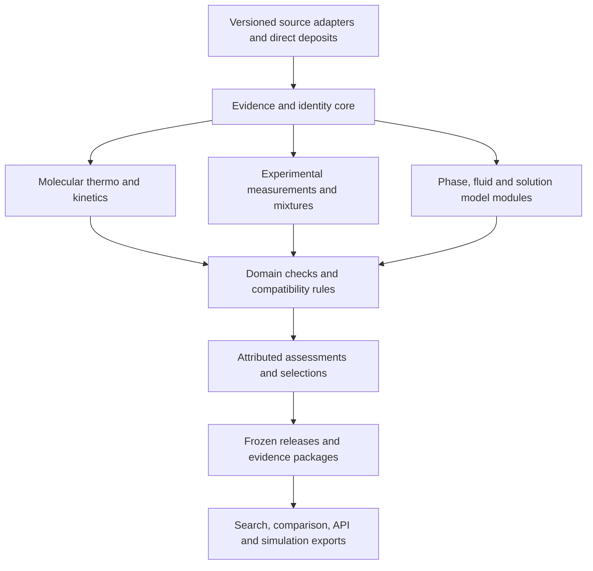

# TCKDB: gap analysis and a path to a scientific publication

Assessment: 2026-09-18; synthesis finalized 2026-09-19. Code baseline: `8539c927d6ca81758d28a67c0a0fbac31a13c9af`.

## Decision

TCKDB has a credible foundation for an integrated molecular thermochemistry and kinetics evidence platform. Its strongest contribution is the connection between chemical identity, computational evidence, scientific products, review decisions, and reproducible release machinery. It is not yet a comprehensive thermochemical reference resource, and implemented infrastructure alone does not establish the accuracy or breadth of a scientific corpus.

The ambition should be **one trusted place to discover, compare, trace, and obtain thermochemical evidence across sources**. Authority should come from explicit evidence and domain-specific assessments. It cannot come from putting every quantity called “enthalpy” into one table or automatically selecting a universal winner.

There are two distinct milestones:

1. **A defensible first paper:** demonstrate the molecular thermo/kinetics evidence lifecycle on a frozen, independently reproducible corpus, close scientific contract defects, and state limits precisely.
2. **A comprehensive community infrastructure:** extend that lifecycle to measurements, correlated uncertainty, source reconciliation, and domain-specific federation. This requires scientific collaborations, sustained curation, and validated adapters as well as software.

Do not postpone the first paper until every domain is implemented. Equally, do not describe the first paper as having achieved the second milestone.

## Evidence and scope

This synthesis combines three independent agent assessments:

- [Scientific coverage and schema audit](tckdb-scientific-coverage-audit.md).
- [Platform and interoperability audit](tckdb-platform-readiness-audit.md).
- [Landscape, prior art, and publication audit](tckdb-landscape-publication-audit.md).

The starting point was [the supplied landscape report](deep-research-report.md), with the existing [paper skeleton](../../paper/19__TCKDB_skeleton/README.md), manuscript reviews, current implementation, tests, and benchmark artifacts checked alongside it. Supporting audits give file/line evidence and primary-source links. Recommendations and proposed acceptance criteria below are design judgments, not completed results.

“Implemented” means found in current source; “demonstrated” requires an identifiable test or measured artifact and says whether it was run in this assessment. “Partial” means an important part exists. “Not found” describes the bounded search, not proof of absence everywhere. No live deployment or production corpus was inspected. Historical corpus counts in the paper folder are not current measurements and must not become publication results.

Vtrace was rebuilt successfully for this worktree and used for orientation. GitNexus was bound to `TCKDB`, but its index was 186 commits behind and queries failed with a storage-engine version mismatch. CLI refresh failed on registry DNS/cache access. The required pre-edit impact attempt for this new report returned `UNKNOWN`; callers and processes were unresolved, not zero. A text search found no existing reference to its filename. Changes are new assessment documents only; no function, class, schema, migration, manuscript, deployment, or scientific record is modified or committed.

## What to retain and correct in the original research

The report correctly distinguishes evidence from fitted models, stresses standard states, identifies covariance as important, and recommends preserving source identity and version history. Its proposed federation model fits the long-term ambition well.

Several parts need tightening before they guide engineering or appear in a paper:

| Research premise | Assessment and consequence |
|---|---|
| Thermochemical information is fragmented across domains | Useful organizing premise. Quantify the practical integration burden with a defined multi-source task; do not treat a narrative survey as a measured community study. |
| Existing resources lack rich provenance or alternative values | Too broad. ATcT, ThermoML, RMG, and computational archives already solve important parts. Describe the particular lifecycle TCKDB integrates and substantiate each comparison. |
| ThermoML is principally an XML access problem | Incomplete. The official archive also documents REST, JSON, and bulk access; start from supported interfaces. See the landscape audit. |
| A universal canonical schema can import each format losslessly | A goal to prove per adapter and supported subset. Preserve original source payloads and explicitly record unmapped fields; successful parsing is not semantic preservation. |
| Every state field should be mandatory everywhere | Require fields according to scientific domain and property. Distinguish unknown, unspecified, and not applicable; never invent a solvent or elemental reference to fill a universal form. |
| Buy commercial databases early | The report assumes unrestricted budget. No such budget or redistribution rights are established here. Prioritize open, attributable sources and demand-driven licensed access. |
| All formats and a 0–30 month schedule are necessary | Unsupported as a delivery commitment. Use dependency and evidence gates; estimate effort after adapter samples and resourcing are known. GraphQL, for example, is an implementation choice rather than a scientific requirement. |
| Existing citation markers establish the evidence | The exported `turn…` citation markers cannot be resolved from the Markdown file alone. Replace claims used in the manuscript with durable primary-source URLs/DOIs and access dates. |

The paper skeleton itself is an input to review, not a source of truth. Some `[KEEP]` claims require further qualification: independently submitted copies are not necessarily independent scientific evidence, and an extensible schema does not prove that every future domain can be added without redesign.

## What each part of the ecosystem does well

The [landscape audit](tckdb-landscape-publication-audit.md) supplies the core verified comparison and references. Additional primary sources are linked below for engineering and geochemical resources. This table translates the comparison into priorities for TCKDB; it is not an exhaustive audit of every resource in the original report.

| Resource family | Strength to learn from or connect to | TCKDB's useful role |
|---|---|---|
| ATcT | Evaluated thermochemical networks, coupled evidence, uncertainty and correlations | Preserve evaluated values and source versions; compare computed candidates using compatible states; eventually support explicit constraints without claiming to reproduce ATcT's full network. |
| NIST WebBook/[JANAF](https://janaf.nist.gov/) | Accessible reference quantities, literature attribution, temperature-dependent thermochemistry | Provide traceable links and supported ingestion, retaining property definitions and reference conventions. |
| NIST TRC/ThermoML | Structured measurements, conditions, uncertainty, mixtures, machine access | Adopt measurement-level semantics and prove a bounded experimental adapter before attempting broad experimental coverage. |
| RMG/Arkane and mechanism tooling | Thermo/kinetics libraries and estimation, multiple candidates, statistical mechanics, executable mechanisms | Connect these products to raw evidence, review decisions, source lineage, and frozen releases; test numerical downstream use. |
| CCCBDB and computational archives | Calculations, methods, structures, experimental comparisons, workflow provenance | Build on TCKDB's existing calculation model and CCCBDB work; preserve external identity and distinguish copied evidence from independent calculations. |
| [REFPROP](https://www.nist.gov/programs-projects/reference-fluid-thermodynamic-and-transport-properties-database-refprop), [DIPPR](https://www.aiche.org/dippr/about), [DDB](https://www.ddbst.com/ddb.html) | Fluid models, engineering correlations, mixture and phase-equilibrium data | Use typed models and explicit access terms; initially link or invoke supported providers instead of flattening models into scalar rows. |
| CALPHAD/[FactSage](https://www.factsage.com/fs_general.php)/[Thermo-Calc](https://thermocalc.com/about-us/methodology/the-calphad-methodology/) | Composition-dependent phase models and internally assessed parameter sets | Add a separate phase/model domain only with domain expertise and demonstrable model preservation. |
| Materials Project/OPTIMADE ecosystem | Structural identity, standardized computation, federated materials queries | Link materials and calculation evidence; keep electronic formation energy separate from finite-temperature formation enthalpy. |
| [NEA TDB](https://oecd-nea.org/jcms/pl_22166/thermochemical-database-tdb-project) and biochemical resources such as [eQuilibrator](https://equilibrator.weizmann.ac.il/static/classic_rxns/about.html) | Aqueous-species/solid reference data and, in biochemical systems, transformed reaction thermodynamics | Build domain profiles for solvent, composition, ionic strength, pH and reference conventions; do not relabel these as ideal-gas quantities. |

“One offering” can include locally held open data, attributed source metadata, and authorized remote services. FAIR access can include authentication and restrictions; it does not imply that every dataset must be open. [GO FAIR explanation](https://www.go-fair.org/resources/faq/what-fair-is-not/).

## What TCKDB already does well

| Capability | Current strength | Limit on the claim |
|---|---|---|
| Molecular identity | Canonical molecular structure, charge/multiplicity, species entries, isotope-aware identity, conformer machinery | Molecular identity is not a full description of a crystal, solution, phase, or thermodynamic standard state. |
| Calculation evidence | Structured methods/software, geometries, energies, frequencies, Hessians, artifacts, source-calculation roles | Preserving evidence enables later analysis; it does not mean every deposit is complete or every calculation can be rerun. |
| Thermo/kinetics breadth | NASA7/9, Wilhoit and tabulated thermo; Arrhenius, falloff, PLOG/Chebyshev; pressure-dependent network structures | Representation support differs by ingestion, read, export and validation surface. A model name is not a tested end-to-end capability. |
| Candidates and curation | Candidate products, review overlays, explicit exploratory/curated profiles, attributed selections | “Well supported,” “approved,” and “most accurate” are different statements. Selection is not probabilistic reconciliation. |
| Portability | Content-oriented uploads, API/client integrations, CHEMKIN and ML delivery, separate recovery archive | A convenience export, curated release and lossless recovery archive have different contracts. |
| Release integrity | Frozen bytes/checksums, selection history, policy/version binding, separate live-divergence reporting | DOI support is not evidence of an actual deposited corpus; release artifacts alone omit some raw evidence. |
| Engineering evidence | Extensive tests and recorded scale experiments; earlier async recovery/access-control findings addressed | Test counts are not scientific accuracy. Existing performance measurements are workload- and hardware-specific. |

These are capabilities worth retaining. The July review should not be copied as a current issue list: release infrastructure, upload recovery and several scientific structures have materially advanced.

## Chemistry gaps: the scientific programme

The publication and platform gates below should not obscure the missing chemistry. TCKDB has substantial molecular representations, but a comprehensive thermochemical offering requires more than additional metadata. There are three distinct questions: **which physical systems can it represent, which scientific transformations can it perform or reproduce, and which chemical space has actually been validated?**

| Scientific capability | Current boundary from the source audit | Concrete question the expanded system should answer |
|---|---|---|
| General thermochemical evaluation | Stored NASA7/9, Wilhoit and tabulated forms plus selected evaluators exist; no general production service joining them into species/reaction H/S/Cp/G and equilibrium calculations was found. | “Give me compatible thermodynamic functions and reaction equilibrium constants over a stated temperature range.” |
| Reaction thermodynamics and thermodynamic consistency | Species thermo and reaction identity exist; no general Hess-cycle/Kirchhoff/detailed-balance checking service was found. | “Do these species thermochemical functions and reaction rates describe a mutually consistent mechanism across temperature?” |
| Quantitative critical evaluation | Candidates, scalar uncertainties and curator selections exist; correlated uncertainty propagation and thermochemical evidence-network reconciliation were not found. | “Given these partly shared experiments and calculations, what formation enthalpy and reaction uncertainty does the combined evidence support?” |
| Statistical-mechanical reconstruction | Frequencies, rotors, electronic levels, corrections and conformer interpretation can be recorded; a single-species Arkane validation harness provides partial reconstruction, but a general validated reconstruction workflow was not found. | “How much do conformer populations, hindered rotors and low-lying electronic states change Cp, entropy and the rate over this temperature range?” |
| Advanced molecular thermochemistry | Existing vocabulary is strong for conventional molecular treatments; the audit did not find structured VPT2/anharmonic coupling or Fermi-resonance results. | “Where does the harmonic treatment fail, and can a deposited anharmonic treatment be represented and independently reproduced?” |
| Pressure-dependent kinetics under changed physical assumptions | Stored PLOG/Chebyshev fits can be evaluated and master-equation inputs represented; no production master-equation re-solving service was found. | “How do branching ratios and stabilization change when I change bath gas, collisional energy transfer or barrier energies?” |
| Solution and biochemical thermodynamics | Phase labels and computational solvent settings exist; composition/activity, ionic strength and transformed biochemical-state models were not found. | “What is this reaction's free energy in this solvent at the specified composition and pH, rather than in an ideal gas?” |
| Nonideal fluids and mixtures | No general EOS, excess-Gibbs-energy or mixture phase-equilibrium model was found. | “At this T/P/composition, what are the chemical potentials, activity/fugacity coefficients, and coexisting phases?” |
| Solids and phase transitions | A solid-phase token exists; crystal-polymorph, lattice/phonon thermodynamics, phase-model and transition representations were not found. | “Which polymorph is stable, and how do its heat capacity and phase-transition contributions change Gibbs energy with temperature?” |
| Experimental property and kinetic evidence | Product records and a molecular-property observation pilot exist; they do not constitute a general thermophysical or kinetic-experiment model. | “Can the original Cp/enthalpy/rate observations, conditions and uncertainty be refitted and compared with the computed prediction?” |

Existing numerical chemistry should not be overlooked: [pressure-dependent rate evaluation](../../backend/app/chemistry/network_kinetics_eval.py) supports PLOG/Chebyshev, the [frontend NASA7 evaluator](../../frontend/src/domain/thermoNasa.ts) computes Cp, and the [Arkane reconstruction harness](../../backend/scripts/validation/arkane_statmech_roundtrip.py) compares single-species S298/Cp(T). The harness approximates torsional projection by dropping the lowest frequencies and explicitly does not reconstruct formation enthalpy with the original atom-energy/bond corrections. It was inspected, not run here. These are foundations to extend and validate, not evidence that a general thermochemical/reaction evaluator is already complete. Existing ensemble and variational-path vocabulary also means that a missing verified calculation must not be misreported as a completely absent concept.

The physical models matter numerically. For compatible formation enthalpies and reaction stoichiometry, reaction uncertainty involves the full covariance matrix, `Var(ΔrH) = νᵀΣν`; correlated inputs change the scientific answer. For a dimensionless thermodynamic equilibrium constant, `K° = exp(−ΔrG°/RT)`; relating it to forward/reverse rate coefficients additionally requires the appropriate concentration/activity conventions. These are chemistry and inference requirements, not merely documentation fields.

Likewise, a phase label cannot supply the composition dependence in `μᵢ = μᵢ° + RT ln(aᵢ)`. Activity models and standard-state transformations are part of the scientific model. Cantera's phase interfaces illustrate the quantities needed for this domain. [Cantera thermodynamics](https://www.cantera.org/stable/python/thermo.html).

TCKDB need not implement every solver internally. A versioned, reproducible integration with an established engine can supply calculations, while TCKDB represents inputs/results, enforces applicability, preserves disagreement, and validates outputs. Arkane already performs statistical-mechanical thermochemistry, transition-state-theory and master-equation calculations; connecting and testing those workflows is more useful than recreating them without a demonstrated need. [Arkane documentation](https://reactionmechanismgenerator.github.io/RMG-Py/reference/arkane/index.html).

For the current molecular focus, prioritize **reaction consistency, uncertainty-aware evaluation, and reproducible molecular thermo/kinetics reconstruction**. These deepen the chemistry closest to the existing implementation. Then add experimental/solution/mixture support, followed by expert-led solid/phase domains. Full multidomain coverage is a long-term scope, not a prerequisite for every first-paper claim.

Chemical coverage is a separate empirical gap: a schema that supports radicals, ions, isotopologues or transition metals does not establish a useful, accurate corpus for them. Publish measured coverage and benchmark errors by chemical family, reaction family, charge/spin, method and T/P range. This assessment did not inspect the live corpus and cannot assert which families are sufficiently populated.

ThermoML and QCSchema help deliver the evidence for this programme. Implementing their parsers alone does not supply the missing physical models, evaluated reference data, or scientific validation.

## What needs to improve first

### 1. Make stored science survive the complete API journey

The scientific audit found a concrete mismatch: standard thermo read responses omit some phase, reference-pressure, and 0 K formation-enthalpy information that exists in storage/upload models. It also reproduced schema-level acceptance of empty NASA content, value-free tabulated points, overlapping NASA9 intervals, and inconsistent point quantities, while a 0 K-only formation-enthalpy payload was rejected. These are validation-layer results; see the audit for exact inputs and boundaries on persistence claims.

Acceptance criteria:

- Test upload → persistence → ordinary read → export with non-default reference pressure and phase, a 0 K-only value, and each supported functional representation.
- Preserve supplied state metadata and distinguish missing values from defaults throughout that path.
- Reject structurally empty or ambiguous executable models. Preserve a scientifically suspect original observation where appropriate, with a machine-readable finding and exclusion from unqualified executable export.
- Validate coefficient shape, interval ordering/overlap, positive temperatures, units, validity ranges and reference conventions using independent fixtures.
- Make consistency checks run on deposited values; tests containing their own Gibbs identity or a fixed reference coefficient set do not establish runtime validation of arbitrary inputs.

This is the highest-priority technical work because it affects the meaning of data consumers receive.

### 2. Make publication reproduce the evidence, not just the selected numbers

The current [release manifest contract](../../backend/app/services/release/manifest.py) explicitly omits raw artifact bytes, geometries and some calculation result payloads. The separate recovery archive is intentionally broader. That distinction is good; a paper must package both layers to the extent required by its claims.

Create one deposited package manifest that binds:

- software commit, schema migration head, dependency/environment information;
- frozen curated release, selected records, candidates, curation policy and decisions;
- a rights-cleared evidence subset or suitable archive, raw artifact digests and retrievable bytes;
- source versions and citations;
- scripts, expected outputs and all manuscript tables/figures.

Rebuild the published analyses from that package in a clean environment without the development instance. Successful checksum verification establishes integrity, while regeneration establishes the separate scientific reproducibility claim. If an electronic-structure rerun needs licensed software, state that limitation and provide the evidence needed for the analyses actually claimed.

### 3. Make rights and contributor intent part of ingestion

[LICENSE-DATA](../../LICENSE-DATA) explicitly records that contributor consent at deposit time is not yet implemented. Release-level license strings do not establish rights for every input. Before broad contribution or source aggregation, record depositor authority/consent, source terms, permitted uses, attribution, and any restrictions on derived artifacts. Audit historical deposits instead of assuming that user-account counts prove either independent consent or a rights violation.

The engineering gate is to prevent a public release or export from silently including material without compatible recorded permissions. Specific source agreements still need source-specific review; this report does not determine legal entitlements.

### 4. Measure completeness and disagreement, not just row counts

Expose coverage by chemical family, charge/spin/isotopes, source class, property, temperature range, model kind, and review status. Report how many records have usable uncertainty, complete evidence, and reproducible derivations. Keep unknown uncertainty distinct from zero uncertainty.

For conflicts, show the definition/state compatibility check, original candidates, source lineage, uncertainty information, and the rationale for any recommendation. Count repeated depositions separately from independent experiments or calculations. Different upload IDs or workflow commits alone do not establish statistically independent evidence.

### 5. Make the public workflow and recovery match the scientific promise

The platform audit identifies a fragmented release-discovery/download journey, typed-client gaps for release operations, and a distinction between approval-filtered queries and actual frozen release selections. Give users one documented path from competing values to a selected release, evidence download, checksum verification and citation. Measure it with independent users; a new frontend is useful for community adoption but is not required for the backend-focused first paper.

Before relying on a hosted service for irreplaceable evidence, demonstrate paired recovery of PostgreSQL and raw artifact storage. The checked-in backup script verifies PostgreSQL restoration, while the audit did not find complete paired object-store recovery orchestration. Also test application/schema compatibility: the current readiness check finding is that any installed migration revision can satisfy its database test. These are source findings, not a diagnosis of the live deployment.

Retain the existing performance evidence and its caveats. The recorded 50,000-species synthetic benchmark is a scale experiment, not a 50,000-species scientifically curated corpus. Refresh representative nonempty workloads at the publication commit, and do not extrapolate workstation measurements to a Raspberry Pi.

## What is missing for the wider ambition

| Gap | Minimum useful addition | Evidence that it works |
|---|---|---|
| General experimental observations | Typed experiment, method, sample/composition, measured variables, state, uncertainty convention, literature/table/row locator | Reconstruct a supported ThermoML dataset without losing conditions or confusing observations with fitted coefficients. |
| Complete state semantics | Domain-specific state/reference definitions and explicit conversion records | Deliberately incompatible gas/aqueous/solid, pressure, or reference-state values are not merged or silently compared. |
| General derivation lineage | Typed input→transformation→output relationships with versioned parameters/software | Trace a fitted product through source points and corrections; identify affected descendants when an input is superseded. |
| Correlated uncertainty | Distributions/coverage conventions, coefficient covariance, shared-source/systematic groups | Recover known propagated uncertainty; missing covariance is reported as unknown, and duplicated inputs do not shrink uncertainty spuriously. |
| Thermodynamic reconciliation | Explicit constraints, weighted/network solve, residuals, influence and covariance, immutable assessment output | Solve an independently specified reference network; detect planted conflicts; compare to simpler baselines and withheld data. |
| Thermo–kinetics consistency | State-aware equilibrium conversion and forward/reverse rate checks | Independent evaluation agrees over a declared T/P grid and flags invalid domains and conventions. |
| Source federation | Versioned adapters, source identity, update/supersession policy, deduplication lineage | Re-ingesting one source version is idempotent; new versions retain history; failures are visible rather than silently dropping records. |
| Domain extensions | Typed models for fluids/mixtures, solids/phases, aqueous or biochemical data | Each domain has expert review and a real end-to-end example; phase enums alone do not qualify. |
| Community stewardship | Documented submission, review, dispute, correction and withdrawal processes; curator responsibility and durable hosting | An external contributor completes a deposition and another curator reviews it; an independent user can reproduce its released result. |

These needs are inferred from the source comparison and observed integration gaps. They are not claimed to be results of a community survey. Validate priorities with domain users: mechanism builders, experimentalists, quantum chemists, data/ML users, and phase/solution specialists. Ask them to complete concrete workflows and record missing information, time, errors, and source-access obstacles.

## Architecture that supports one offering

Keep a small common evidence contract and domain modules. The common contract describes identity, record type, scientific definition, source/version, provenance links, uncertainty status, rights, review and release identity. The domain modules describe the science that cannot safely be universalized.

Storage can remain relational while exposing provenance as a graph of relationships. A graph database is not itself a requirement. Similarly, a molecular statmech record should record and link a treatment before TCKDB claims to execute it; use versioned external engines when appropriate.

Keep measurement, calculation, assessment, correlation/function, and transformation roles distinct. Fit parameters need units, conventions, covariance when available, and domain of validity. A source adapter should declare which subset it supports, exact/lossy mappings, rejected records, and available original payloads.

For licensed services, searchable metadata and a route to authorized access may provide the useful integration. Do not assume the source permits copying values, metadata or derived models without checking its terms.

### Complementary scientific interchange standards

The [standards follow-up](tckdb-interchange-standards.md) makes two adapters explicit: **ThermoML XML for experimental thermodynamic property evidence**, and **MolSSI QCSchema JSON for quantum-chemistry inputs/results**. QCElemental provides Python models and validation for QCSchema; QCArchive is a calculation-management service that could later supply records through a separate connector. These are distinct integration layers. [NIST ThermoML](https://trc.nist.gov/ThermoML/Browse), [MolSSI QCSchema](https://molssi.org/software/qcschema-2/), [QCArchive](https://docs.qcarchive.molssi.org/).

Prioritize a pinned, bounded QCSchema result importer against the existing calculation model, while designing the experimental observation/state/uncertainty model required for meaningful ThermoML ingestion. Then prove a narrow ThermoML property class. Retain original documents and source versions; report unsupported fields and semantic conversions; add export only for a declared representable subset. Preserving an original XML/JSON file is valuable evidence custody, but does not by itself establish a lossless normalized mapping. No existing implementation of these adapters was found in the runtime/client/schema and backend dependency files searched on 2026-09-19.

For the paper, demonstrate an experimental reference and an independently computed candidate for the same precisely defined quantity/state, with their source documents, transformations and disagreements preserved. Importing a QCSchema electronic energy alone must not create a formation enthalpy or finite-temperature thermochemistry result.

## Dependency-ordered roadmap

These are proposed work packages, not dates or promises. Effort classes are relative: small = bounded contract/docs fix; medium = a cross-layer feature; large = a scientific subsystem or sustained curation program.

| Stage | Deliverables | Exit gate | Relative effort |
|---|---|---|---|
| A — trustworthy molecular contract | Fix read/validation gaps; reconcile manuscript and source claims; define exact first-paper scope | End-to-end state/model contract tests pass; no unsupported paper claims remain | Small–medium |
| B — publication evidence | Curate representative corpus; resolve rights; freeze source/code/evidence; deposit reproducibility scripts and case studies | An independent person regenerates every reported result from the package | Medium plus curation |
| C — experimental bridge | Observation/derivation/state core; source registry; bounded ThermoML plus reference-data adapters | One multi-source molecular comparison retains every source definition, uncertainty convention and lineage link | Large |
| D — uncertainty and consistency | Shared-source groups, covariance propagation, domain checks, conflict reporting | Independent numerical tests and calibrated uncertainty/consistency benchmark; no pseudo-replication | Large |
| E — assessed recommendations | Versioned thermochemical constraint networks, reconciliation, influence analysis | Better specified outcomes than baselines on held-out cases, with interpretable failures | Large; research |
| F — cross-domain federation | One expert-led fluid/solution/materials extension at a time; authorized connectors | Domain-specific semantics, rights, round-trip and downstream-use benchmarks pass | Large per domain |
| G — active improvement | Value-of-information ranking connected to validated calculation/experimental workflows | Prospective reduction in target uncertainty versus random/heuristic acquisition at recorded cost | Research; follows D/E |

Contributor workflows, archival durability, security, and performance evolve across these stages; they are not deferred until stage G. A first paper can follow A/B. A paper claiming multi-source unification requires C and the relevant parts of D. A probabilistic reconciliation paper requires E and its own evidence.

Do not add every adapter first. Implement a thin but complete path through a few complementary sources and use it to stabilize semantics. Do not begin an autonomous acquisition loop before uncertainty, costs, data quality and failure handling can be measured.

## Scientific validation and publication plan

### Recommended first-paper claim

> TCKDB connects molecular thermochemistry and kinetics products to structured computational evidence, separates candidates from attributed curation decisions, and supports reproducible scientific releases and downstream reuse.

Candidate title: **“TCKDB: an evidence-preserving platform for molecular thermochemistry and kinetics.”** The title and database expansion/name should be made consistent across the manuscript and `CITATION.cff`; the current materials use different expansions.

This is a systems/data-model contribution with scientific case studies. It does not assert that TCKDB is more accurate than ATcT, replaces RMG, executes every statmech treatment it stores, or already supports all thermochemical domains. A hedge such as “to our knowledge” does not rescue an inaccurate competitor comparison.

### Required experiments and artifacts

| Experiment | Design | Reported outcomes |
|---|---|---|
| Identity and state challenge | Expert-labelled positives/negatives spanning tautomers, stereoisomers, isotopologues, spin, conformers, phases and standard states | False merges/splits, ambiguous cases, exact exclusions; stratify by class. |
| Molecular evidence lifecycle | At least one complete and one deliberately incomplete calculation→product→review→release chain | Recoverable inputs, deterministic evidence findings, exact selection rationale and reproducible released result. |
| Mechanism interoperability | Existing RMG-generated fixture plus additional supported model cases; import/store/export and evaluate independently | Identity preservation and numerical Cp/H/S/k(T,P) differences over declared domains, parser failures, unsupported cases. |
| Real disagreement case | Two independently sourced candidate determinations with compatible definitions | Both preserved, reasons for disagreement visible, curation or abstention explicit; no manufactured uncertainty reduction. |
| Hessian re-analysis | Deposit the reconstruction/projection script, input refs, masses, conventions and per-case results | Spectral agreement and failure categories from the frozen data; do not copy development-instance numbers. |
| Release/archival reproducibility | Restore or reconstruct on a fresh instance; rerun all result-generation scripts without the live service | Checksums, selected refs and numerical outputs agree under declared tolerances; note permitted exclusions. |
| Performance | Recorded hardware, data distributions, queries, concurrency, warm/cold state and error behavior | Latency percentiles, throughput, statement counts and resource cost; separate synthetic scale from scientific coverage. |

Predefine scientific tolerances and exclusions for each model. Internal archive fidelity can demand exact bytes/values where its contract promises them; numerical interchange tolerances must account for representation precision. There is no single error threshold appropriate to every species, property and temperature.

For the later reconciliation claim, add held-out reference comparisons, cycle residuals normalized by covariance, interval coverage/calibration, and influence analysis. Compare against source-only retrieval, newest/highest-ranked selection, and independent-error averaging where those baselines are meaningful. Ablate source deduplication, state checks and covariance separately. Split by underlying evidence lineage and chemical families to prevent copied literature or related calculation series leaking across train/test.

### Figures and tables that would earn their place

1. Evidence lifecycle with one real record chain and its frozen release.
2. Capability comparison with source-backed, narrowly defined cells and “not assessed” where appropriate.
3. Corpus coverage/completeness map from the deposited snapshot.
4. One disagreement or later re-analysis that the preserved evidence makes possible.
5. Reproducibility and numerical interoperability results, including failures.

The main text should explain the scientific problem, data model, decision boundaries, experiments, results and limits. Put schema details, exact checks, adapters, environment pins, per-record benchmark outputs and complete comparison citations in supporting information. Preserve the current author's backend/data-model emphasis; an expanded frontend is not a prerequisite for this paper.

### Submission gates

- [ ] Scientific contract defects are fixed and verified through the complete workflow.
- [ ] Every comparative/novelty claim has a primary citation and fair scope.
- [ ] Every number is generated from a named, frozen artifact by a deposited script.
- [ ] Corpus permissions and contributor agreements are resolved and recorded.
- [ ] Curation decisions have attributable rationales; unexplained conflict and incomplete evidence are visible.
- [ ] A complete evidence package supports all reproducibility claims without relying on the development server.
- [ ] Required repository CI gates pass for the exact publication commit; successful historic tests are not substituted.
- [ ] An independent reproduction report is included or retained for review.
- [ ] Dataset/software citations, actual persistent identifiers, availability statements and limitations match the deposit.

Repository inspection can establish that the necessary machinery exists. It cannot mark these publication gates complete without the actual corpus, executions, review and deposit.

Checks actually performed during this assessment were deliberately bounded: current-source inspection, the schema-only probes reproduced in the scientific audit, and **104 passing offline client tests** for OpenAPI coverage bookkeeping, parity documentation and retries. These tests do not establish backend scientific correctness, production health or publication readiness. Local Markdown source links in the four new reports were checked for existing targets. The full backend suite and proposed publication experiments were not run.

## Immediate next implementation sequence

1. Repair thermo state readout and validation, with full-workflow regression cases for the reproduced findings.
2. Freeze a claim-to-evidence checklist using the current manuscript skeleton and this audit; correct competitor claims and citations.
3. Establish contributor/source rights capture and resolve historical corpus permissions before public data release.
4. Select and curate a compact but scientifically representative molecular corpus; include genuine disagreement and incomplete-evidence examples.
5. Build the deposited reproduction package and regenerate the manuscript's results from it.
6. Start a bounded ThermoML/experimental bridge as the first expansion toward the comprehensive offering.

The decisive change is to make TCKDB the place where a user can see what a result means, why it should be trusted, what disagrees with it, and how to reproduce or use it. Broad coverage then becomes a sequence of verifiable domain additions rather than an untestable promise to contain everything.
