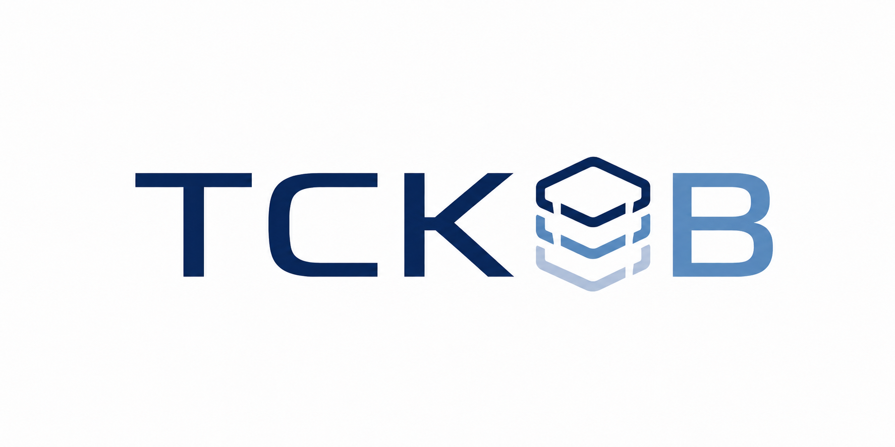

# TCKDB

{ width="760" }

TCKDB is a thermochemistry and kinetics database for computational and
experimental chemistry records. It stores scientific values together
with the context needed to trust them: geometries, calculations,
levels of theory, software versions, workflow provenance, artifacts,
and review state.

The project is intended to sit between workflow tools and downstream
users. ARC, RMG, custom scripts, or other computational chemistry
pipelines can upload structured records; humans and programs can query
those records later through a stable HTTP API or Python client.

!!! note "Project status"
    TCKDB is pre-1.0 research infrastructure. The backend, Python
    client, local deployment, and scientific read API exist, but schema
    and upload payloads may still change before a stable release.

## What You Can Do

- Run TCKDB locally with Postgres/RDKit, MinIO, and the FastAPI backend.
- Load a small demo dataset and query methane, ethane, radicals,
  thermo, calculations, geometries, reactions, and kinetics.
- Query scientific records by chemistry-first handles such as SMILES,
  species refs, reaction refs, geometry refs, and level-of-theory refs.
- Upload structured scientific JSON records with provenance.
- Deploy a single-node instance for a group or lab.

## Start Here

If you are new to the project:

1. Read [Getting Started](getting-started.md).
2. Run the local quick start.
3. Load [Demo Data](demo-data.md).
4. Try the [Querying](querying.md) examples.

If you are integrating a workflow tool, start with [Uploads](uploads.md)
and the [ARC adapter spec](../specs/arc-tckdb-adapter-v0-spec.md).

If you are deploying TCKDB for other people, start with
[Deployment](deployment.md).
